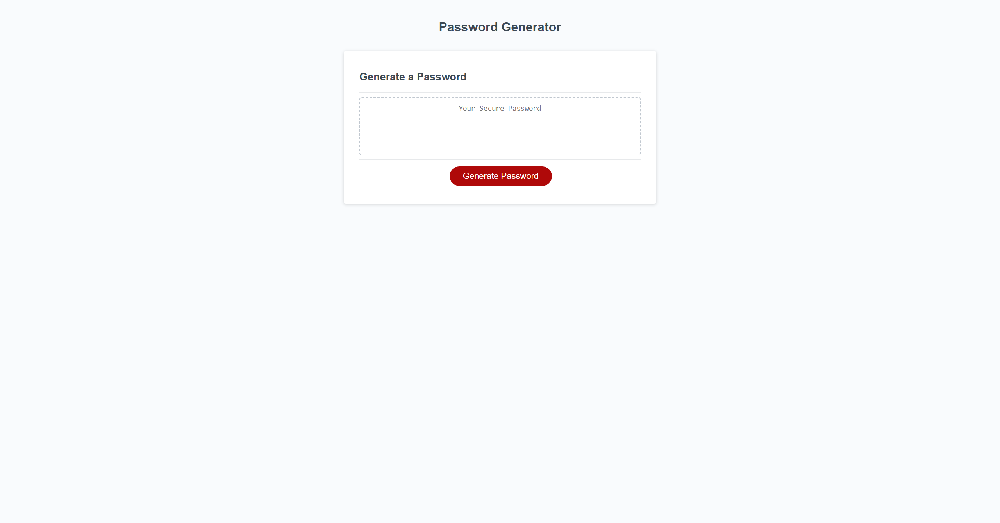
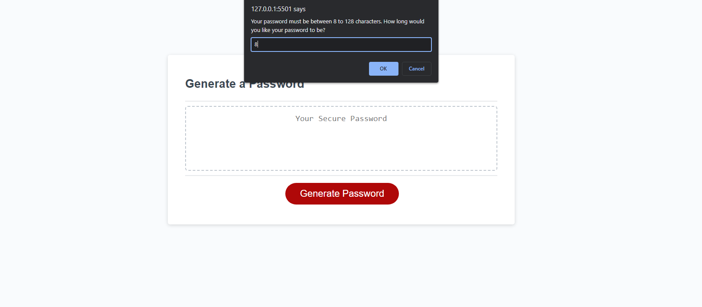
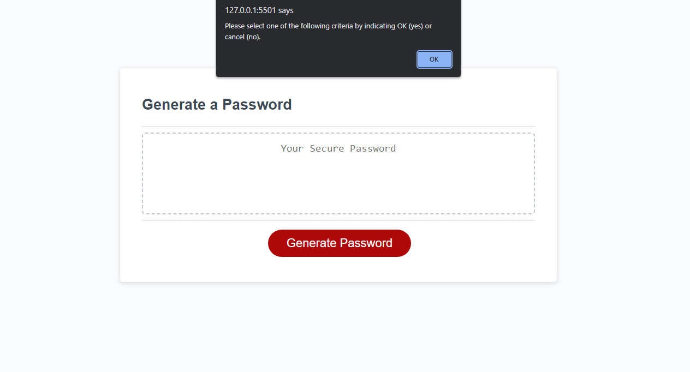
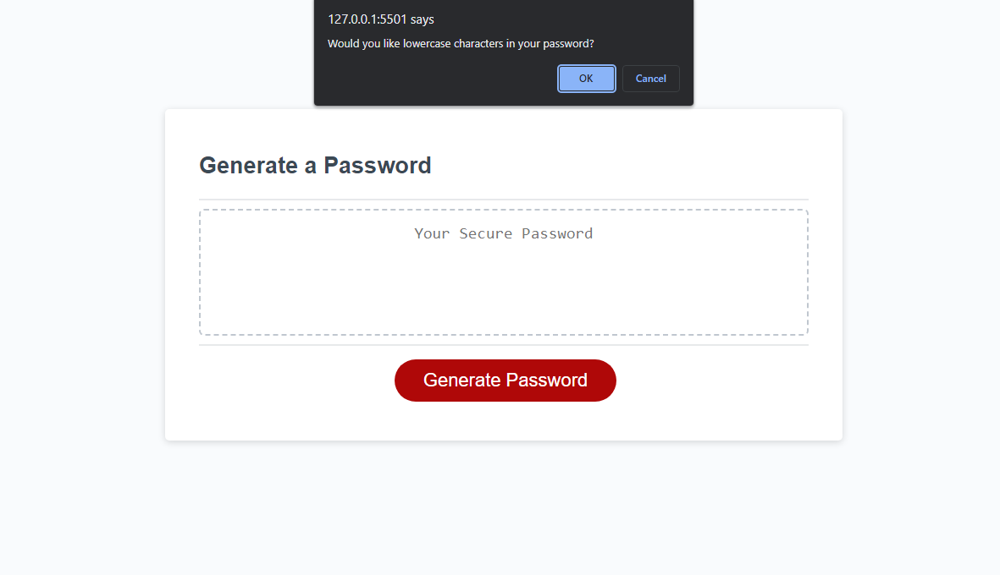
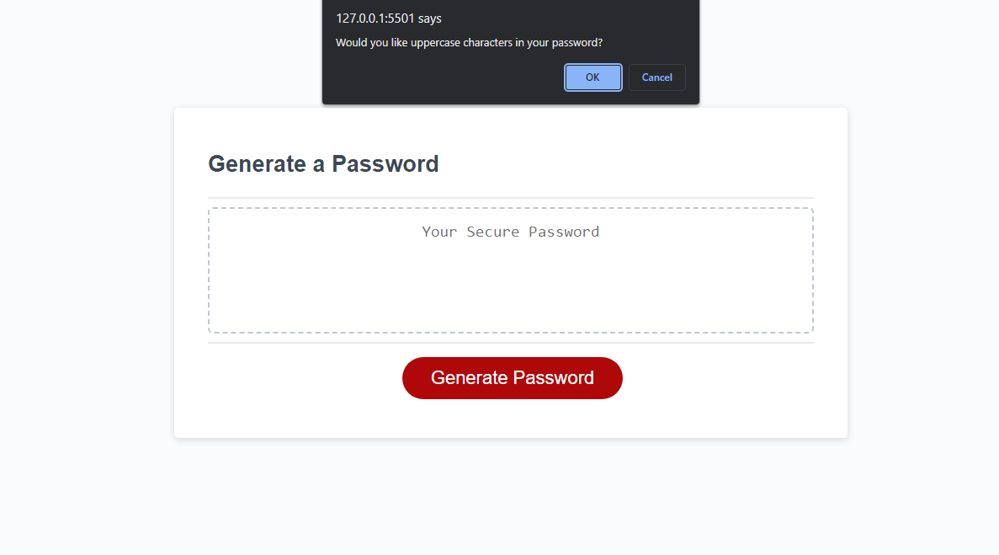
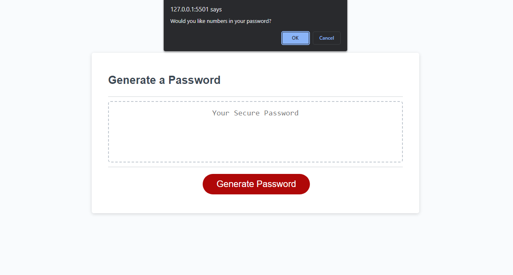
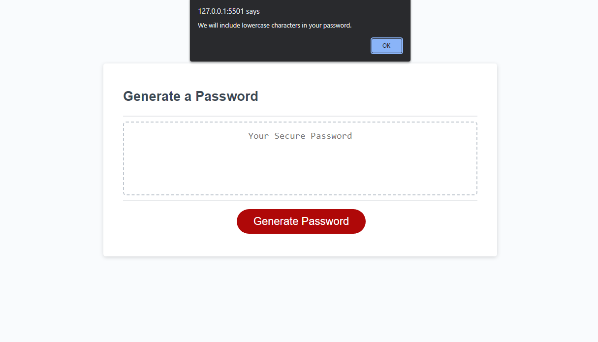
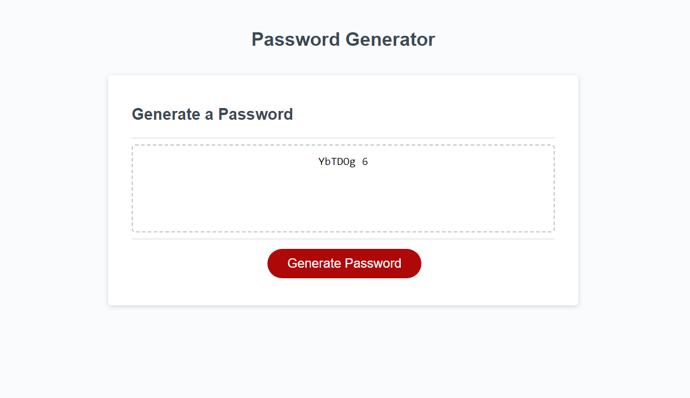

# Password Generator

## Description

This website generates a randomized password based off of a series of prompts. In building this project, I was able demonstrate the usage of while loops, for loops, functions, forEach methods, and objects.

## Installation

The website can be found [here](https://claricetran.github.io/password-generator).

## Usage

After opening the site the user will find the following starting screen:

Then the user should click on the Generate Password button and answer a series of prompts.

The user will then be asked to input a number between 8 and 128.

The user will be instructed to answer OK or cancel to confirm a password criteria.

The lowercase question will prompt like so:

The uppercase question will prompt like so:

The number question will prompt like so:

The special characters question will prompt like so:

After each prompt, the user will get a confirmation prompt.

After each prompt, the generated password will print in the center textbox including all of the criteria that the user asked for.

## Credits

[Base code from Xandromus](https://github.com/coding-boot-camp/friendly-parakeet)  
[W3 Schools reference for UTF-8 char set](https://www.w3schools.com/charsets/ref_utf_basic_latin.asp)  
[Tutorial: Javascript match values in two arrays](https://daily-dev-tips.com/posts/javascript-match-values-in-two-arrays/)
